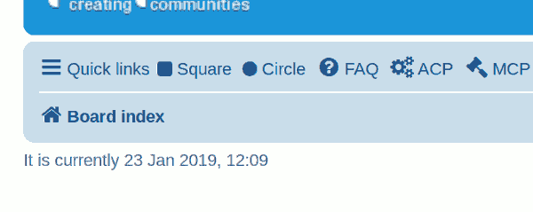

# phpBB Extension - marttiphpbb Menu Items (helper ext)

## This extension is only in the stage of initial development

This phpBB extension provides menu links for other extensions

[Topic on phpBB.com](https://www.phpbb.com/community/viewtopic.php?f=456&t=2468816)

## Requirements

* phpBB 3.2.5+
* PHP 7.1+

## Quick Install

You can install this on the latest release of phpBB 3.2 by following the steps below:

* Create `marttiphpbb/menuitems` in the `ext` directory.
* Download and unpack the repository into `ext/marttiphpbb/menuitems`
* Enable `Menu Links` in the ACP at `Customise -> Manage extensions`.

## Uninstall

* Disable `Menu Links` in the ACP at `Customise -> Extension Management -> Extensions`.
* To permanently uninstall, click `Delete Data`. Optionally delete the `/ext/marttiphpbb/menuitems` directory.

## Support

* Report bugs and other issues to the [Issue Tracker](https://github.com/marttiphpbb/phpbb-ext-menuitems/issues).

## License

[GPL-2.0](license.txt)

## Screenshots

These examples are taken from the [Menu Items Example](https://github.com/marttiphpbb/phpbb-ext-menuitemsexample) extension.

### Simple Example of Menu Rendering

### Priority Examples

The priority can be set for the rendering of the menu items in
the same template event location.

#### "Square" Link Higher Priority

#### "Circle" Link Higher Priority

